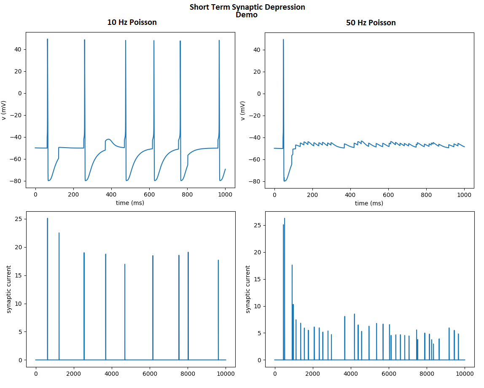

# Short-Term Synaptic Plasticity (STSP) Demo

Python notebook and NEURON code explaining and demonstrating short-term synaptic plasticity. 

### Jupyter Notebook:

#### Static Viewer

[Click here](https://nbviewer.jupyter.org/github/tjbanks/synaptic_plasticity/blob/master/ShortTermSynapticPlasticity.ipynb)

#### Dynamic Viewer

### NEURON Model

Implements STSP using NEURON and BMTK, located in the [bmtk_model](/bmtk_model) folder.

